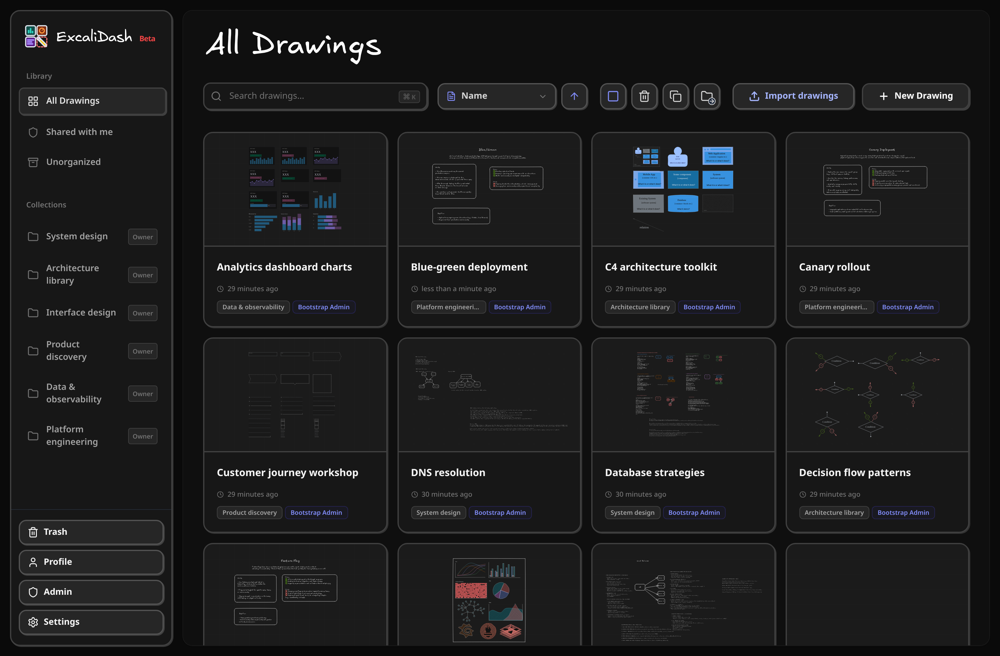

# ExcaliDash

Self-hosted Excalidraw workspaces with collections, real-time collaboration,
sharing, history, backups, and local or OpenID Connect authentication.

[](https://excalidash.xyz)

Read the documentation at [excalidash.xyz](https://excalidash.xyz).

## Quick start

```sh
git clone https://github.com/ZimengXiong/ExcaliDash.git
cd ExcaliDash
docker compose -f docker-compose.prod.yml up -d
```

Open <http://localhost:6767>. Configuration and deployment guidance live in
the [documentation](https://excalidash.xyz).

ExcaliDash is licensed under the GNU Lesser General Public License v3.0.
